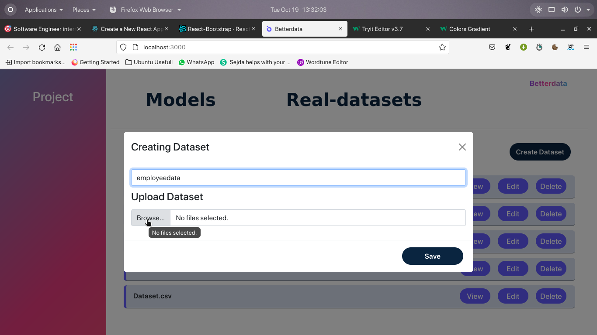

# betterdata
This task tests for data processing of a csv file in the frontend including restricting inputs to certain data types, removing unwanted columns / rows, etc 
<h2 align ="center">
Used Tech-stack:
</h2>
<ul>
  <li><b>ReactJs</b> </li>
  <li><b>React-bootstrap</b></li>
  <li><b>Css</b></li>
  <li><b>Styled-components</b></li>
  </ul>
   
   

  <h2 align ="left"> Slide 1 </h2>
  

  <h2 align ="left"> Slide 2 </h2>
  

  <h2 align ="left"> Slide 3 </h2>
  

  <h2 align ="left"> Slide 4 </h2>
  

  <h2 align ="left"> Slide 5 </h2>
  

  <h2 align ="left"> Slide 6 </h2>
  

