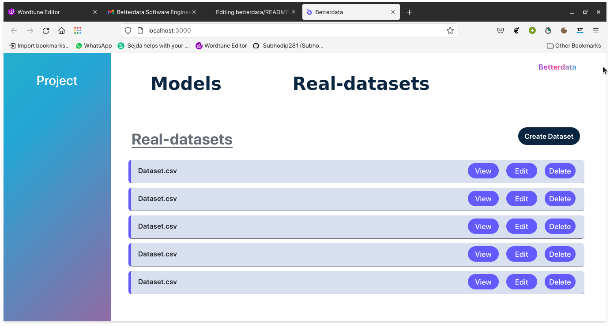
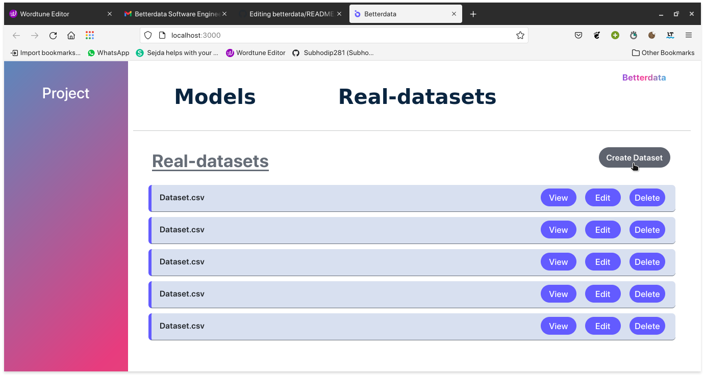
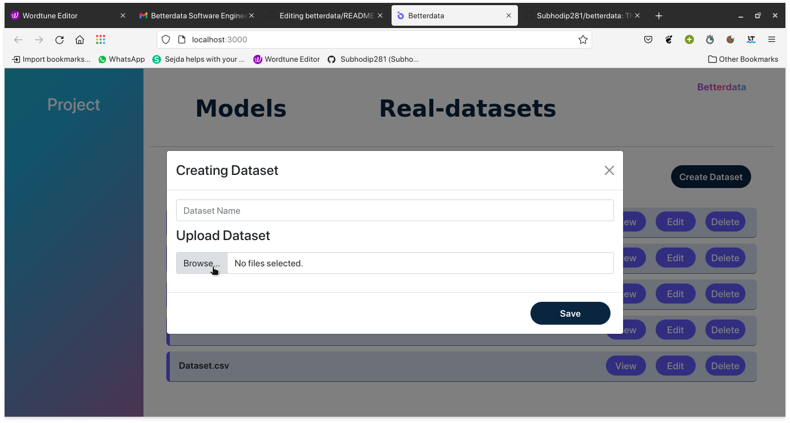
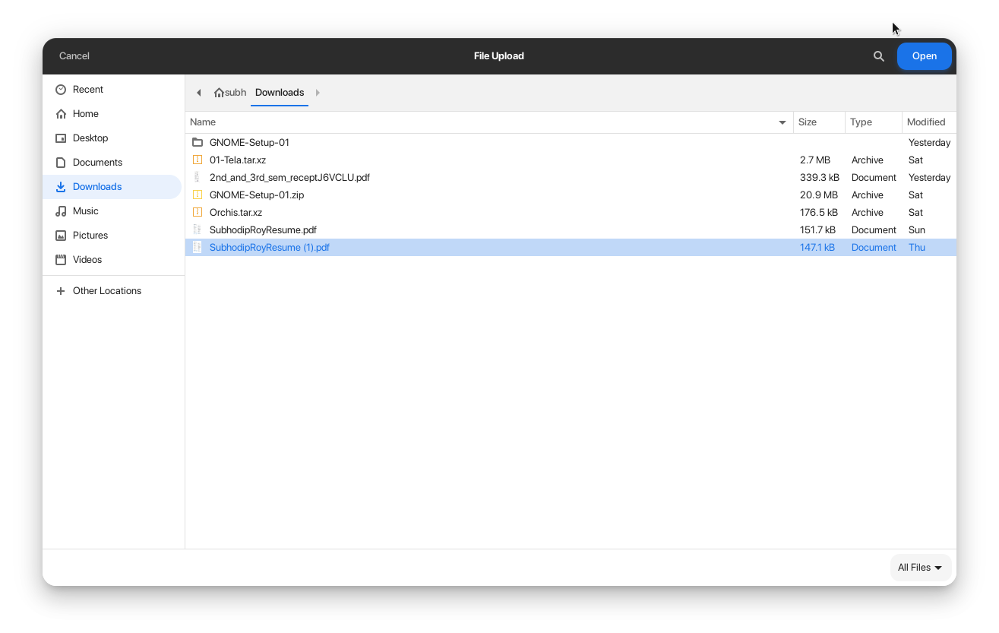
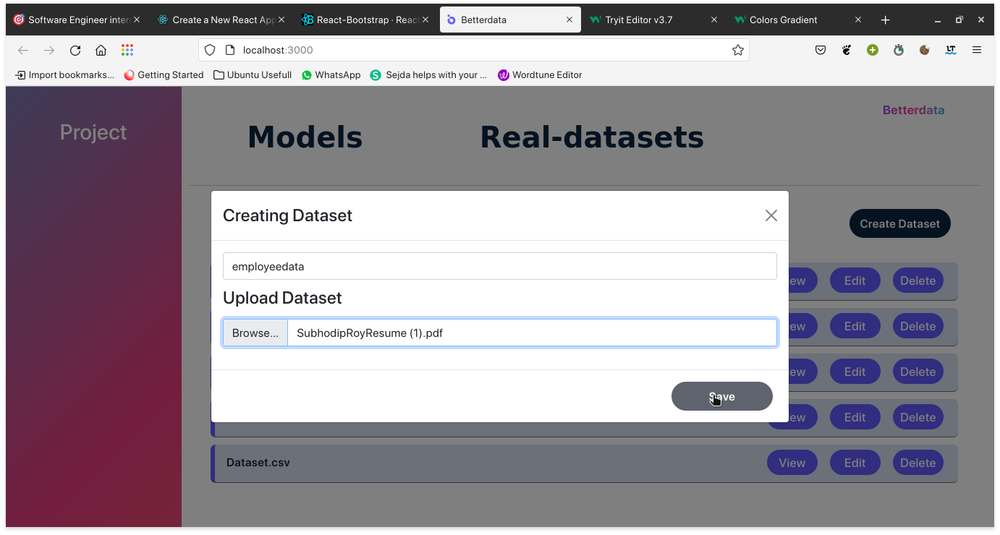
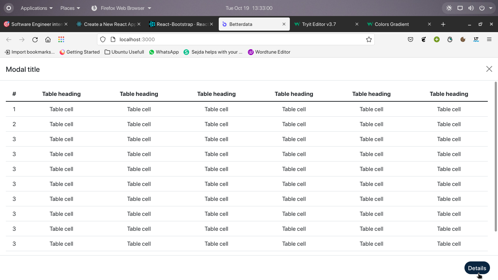

# betterdata
This task tests for data processing of a csv file in the frontend including restricting inputs to certain data types, removing unwanted columns / rows, etc 
<h2 align ="center">
Used Tech-stack:
</h2>
<ul>
  <li><b>ReactJs</b> </li>
  <li><b>React-bootstrap</b></li>
  <li><b>Jsx</b></li>
  <li><b>Css</b></li>
  <li><b>Styled-components</b></li>
  </ul>
  

  <h2 align ="left"> Slide 1 </h2>
  <h5> Full web-view </h5>
  

  <h2 align ="left"> Slide 2 </h2>
  <h5> Upload dataset from local and provide a name using 'Creating dataset' button </h5>
  

  <h2 align ="left"> Slide 3 </h2>
  <h5> Provide dataset name as per your choice</h5>
  

  <h2 align ="left"> Slide 4 </h2>
  <h5> Upload file from your local </h5>
  

  <h2 align ="left"> Slide 5 </h2>
  <h5> Uploading process as follows </h5>
  

  <h2 align ="left"> Slide 6 </h2>
  <h5> By clicking 'save' button your creating dataset process will be completed </h5>
  

  <h2 align ="left"> Slide 7 </h2>
  <h5> View your uploaded dataset </h5>
  

  <h2 align ="left"> Details about the current dataset </h2>
  

