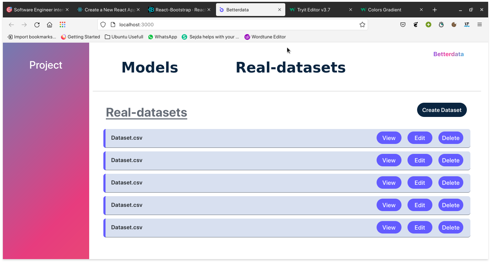

# betterdata
This task tests for data processing of a csv file in the frontend including restricting inputs to certain data types, removing unwanted columns / rows, etc 

  <h2 align ="left"> Slide 1 </h2>
  

